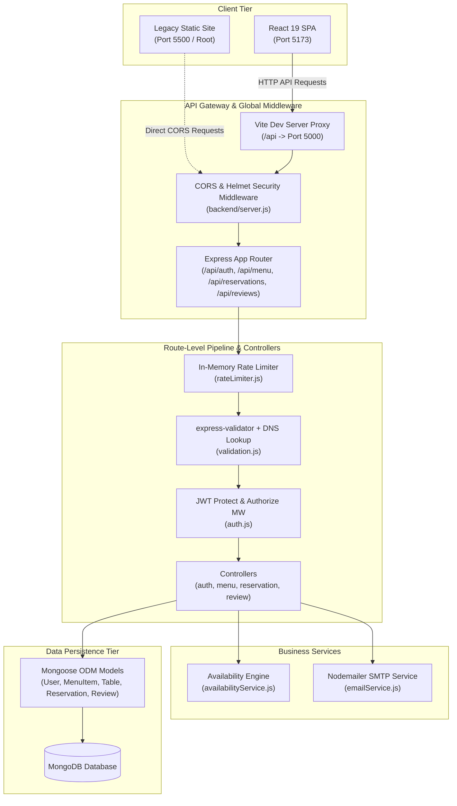
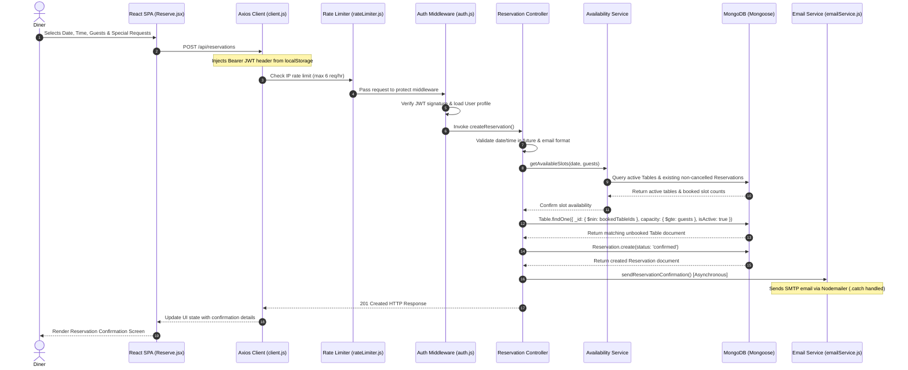
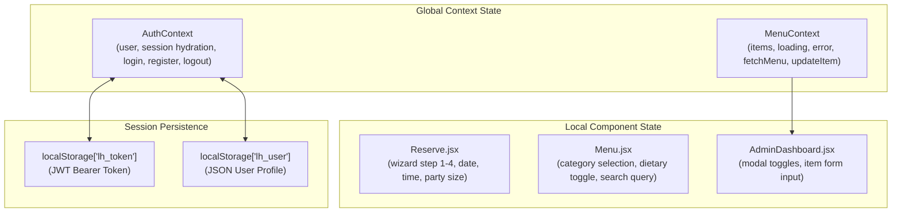
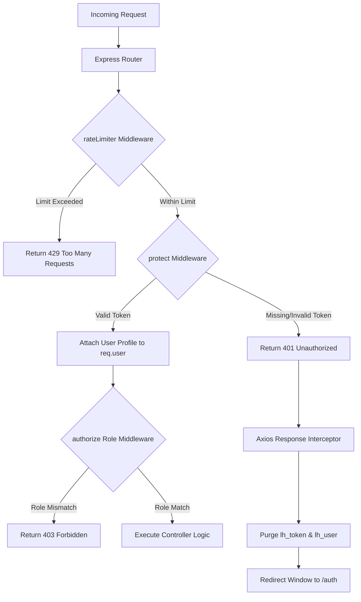

# System Architecture: The Lighthouse

This document details the software architecture of **The Lighthouse** restaurant application. It provides design patterns, data flows, subsystem boundaries, component specifications, and operational workflows for maintainers and contributors.

---

## 1. System Overview

The Lighthouse is a full-stack restaurant management, reservation, and fine-dining showcase platform. Its core architectural differentiator is a **live menu availability engine** designed to solve the "Black Box Menu" problem by exposing real-time dish availability and time-of-day dynamic menus to guests during table reservation.

### Subsystems & Coexistence
The codebase contains two parallel systems:

1. **Active Full-Stack Application:** A decoupled MERN (MongoDB, Express, React, Node.js) system divided into:

   - **`/frontend`:** A single-page application (SPA) built using React 19, Vite, React Router v7, and Axios.

   - **`/backend`:** A REST API built with Express.js and Node.js using Mongoose to interface with MongoDB, featuring JWT authentication, role-based authorization, rate limiting, and dynamic DNS email validation.

2. **Legacy Static Client (Repository Root):**
   - Self-contained static website (`index.html`, `script.js`, `style.css`) using mock data, local JSON translations ([/locales](./locales)), and `localStorage`. Operates independently of the Express API.

### Network Topology & System Architecture



---

## 2. Repository Structure

```text
The-Lighthouse/
├── .github/
│   └── workflows/
│       └── sanity-checks.yml      # CI workflow checking legacy root files
├── backend/                       # Express REST API application
│   ├── src/
│   │   ├── config/
│   │   │   ├── database.js        # MongoDB Mongoose connection handler
│   │   │   └── seed.js            # Database truncation & initial dataset seeder
│   │   ├── controllers/
│   │   │   ├── authController.js  # Registration, login, profile, and dietary updates
│   │   │   ├── menuController.js  # Menu CRUD, availability toggle, tonight's menu
│   │   │   ├── reservationController.js # Slot availability, booking creation, listing, cancellation
│   │   │   └── reviewController.js# Guest review management
│   │   ├── middleware/
│   │   │   ├── auth.js            # JWT verification & role authorization middleware
│   │   │   ├── rateLimiter.js     # Custom Map-based sliding window rate limiter
│   │   │   └── validation.js      # Input validation & DNS MX email domain check
│   │   ├── models/
│   │   │   ├── MenuItem.js        # Dish schema, availability boolean, compound indices
│   │   │   ├── Reservation.js     # Booking schema with partial unique index
│   │   │   ├── Review.js         # Guest review & rating schema
│   │   │   ├── Table.js          # Seating capacity & section schema
│   │   │   └── User.js           # Account schema, bcrypt hooks, dietary preferences
│   │   ├── routes/
│   │   │   ├── authRoutes.js      # Endpoint router for /api/auth
│   │   │   ├── menuRoutes.js      # Endpoint router for /api/menu
│   │   │   ├── reservationRoutes.js # Endpoint router for /api/reservations
│   │   │   └── reviewRoutes.js    # Endpoint router for /api/reviews
│   │   └── services/
│   │       ├── availabilityService.js # Slot calculation & table capacity algorithm
│   │       └── emailService.js    # Async Nodemailer SMTP notification delivery
│   ├── .env.example               # Backend environment variable template
│   ├── package.json               # Backend dependencies (Express, Mongoose, JWT, Nodemailer)
│   └── server.js                  # Express API entry point & error handler
│
├── frontend/                      # React 19 + Vite SPA application
│   ├── public/                    # Static public assets
│   ├── src/
│   │   ├── api/
│   │   │   ├── authApi.js         # Auth API request methods
│   │   │   ├── client.js          # Base Axios client with JWT interceptor
│   │   │   ├── menuApi.js         # Menu API request methods
│   │   │   ├── reservationApi.js  # Reservation API request methods
│   │   │   └── reviewApi.js       # Review API request methods
│   │   ├── assets/                # Media assets for React components
│   │   ├── components/
│   │   │   ├── CustomCursor.css   # Custom cursor styling
│   │   │   ├── CustomCursor.jsx   # Interactive cursor tracking component
│   │   │   ├── Footer.jsx         # Site footer component
│   │   │   ├── MenuCard.jsx       # Dish presentation card & availability toggle UI
│   │   │   ├── Navbar.css         # Navigation bar styling
│   │   │   ├── Navbar.jsx         # Header navigation bar component
│   │   │   ├── ProtectedRoute.jsx # Client-side route authorization guard
│   │   │   ├── Tooltip.css        # Tooltip utility styling
│   │   │   └── Tooltip.jsx        # Custom hover tooltip component
│   │   ├── context/
│   │   │   ├── AuthContext.jsx    # React Context for user authentication & session state
│   │   │   └── MenuContext.jsx    # React Context for menu fetching & in-place state mutation
│   │   ├── pages/
│   │   │   ├── AdminDashboard.jsx # Menu management & dish toggle control panel
│   │   │   ├── Auth.jsx           # Guest sign-in / registration page
│   │   │   ├── Home.jsx           # Landing page with reviews & feature showcase
│   │   │   ├── Menu.jsx           # Full menu view with dietary filters
│   │   │   └── Reserve.jsx        # 4-Step table reservation wizard
│   │   ├── App.jsx                # Client router tree & context providers setup
│   │   ├── index.css              # Global styles & design system CSS variables
│   │   └── main.jsx               # React DOM root render entry point
│   ├── .oxlintrc.json             # Oxlint linter configuration
│   ├── index.html                 # Vite HTML template
│   ├── package.json               # Frontend dependencies (React 19, React Router v7, Axios, Vite)
│   └── vite.config.js             # Vite dev server configuration & API proxy rule
│
├── images/                        # Image assets consumed by application views
├── locales/                       # Translation JSON files for legacy static site
├── .gitignore                     # Git exclusion rules
├── CODE_OF_CONDUCT.md             # Code of Conduct policy
├── CONTRIBUTING.md                # Legacy contributor setup guide
├── Favicon.ico                    # Site favicon asset
├── index.html                     # Legacy static site landing page
├── LICENSE                        # Project license
├── Readme.md                      # Primary project overview and setup manual
├── robots.txt                     # Search engine crawler instructions
├── script.js                      # Legacy static site client script
├── SECURITY.md                    # Security vulnerability policy
├── sitemap.xml                    # Site structure XML for SEO
└── style.css                      # Legacy static site stylesheet
```

---

## 3. Core Request Lifecycle & Data Flow

### A. Table Reservation Execution Lifecycle
When a guest completes the reservation wizard in [Reserve.jsx](./frontend/src/pages/Reserve.jsx), the request proceeds through rate limiting, authentication, business validation, table selection, and async notification:



### B. Dynamic Timezone Menu Resolution (`GET /api/menu/tonight`)
To render Step 3 ("Tonight's Menu Preview") inside the reservation wizard:

1. The client issues `GET /api/menu/tonight` with an optional `x-timezone` header or `timezone` query parameter (defaults to `'Asia/Kolkata'`).

2. `getTonightMenu` in [menuController.js](./backend/src/controllers/menuController.js) calculates the current local hour string using `Intl.DateTimeFormat`:
   ```javascript
   const localHourString = new Intl.DateTimeFormat('en-US', {
     timeZone: timezone,
     hour: '2-digit',
     hour12: false
   }).format(new Date());
   ```

3. Maps the calculated hour to category filters:
   - `hour < 11`: `['breakfast']`
   - `11 <= hour < 15`: `['lunch']`
   - `hour >= 15`: `['dinner', 'desserts', 'drinks']`

4. Queries MongoDB for available dishes (`isAvailable: true`) matching those categories, ordered by `sortOrder`.

### C. Global Error Handling

- **Backend:** Uncaught runtime exceptions fall through to the error handler middleware registered in [server.js](./backend/server.js#L57-L63), returning `{ success: false, error: 'Something went wrong!' }` with status `500`. Business rule violations yield explicit status codes (`400`, `401`, `403`, `404`, `429`).

- **Frontend Interceptor:** The central Axios instance in [client.js](./frontend/src/api/client.js) catches `401 Unauthorized` HTTP responses, purges `lh_token` and `lh_user` from `localStorage`, and redirects the window location to `/auth`.

---

## 4. Layer Responsibilities & Boundaries

### Presentation Layer (`/frontend/src/pages` & `/frontend/src/components`)

- Renders application views (`Home`, `Menu`, `Reserve`, `Auth`, `AdminDashboard`) and shared interface components (`Navbar`, `Footer`, `MenuCard`, `CustomCursor`, `Tooltip`).

- Delegates API communications exclusively to API helper wrappers (`authApi.js`, `menuApi.js`, `reservationApi.js`, `reviewApi.js`) and React Context hooks (`useAuth`, `useMenu`).

### Client API & State Tier (`/frontend/src/api` & `/frontend/src/context`)

- Configures Axios defaults (`baseURL: '/api'`) and attaches authorization headers dynamically.

- **`AuthContext`:** Manages user session hydration, sign-in/registration methods, logout, and in-memory profile synchronization.

- **`MenuContext`:** Manages menu data state, loading/error flags, menu refetching (`fetchMenu`), and targeted single-item state updates (`updateItem`) for instant UI synchronization when administrators toggle dish availability.

### Middleware & Validation Tier (`/backend/src/middleware`)

- **[rateLimiter.js](./backend/src/middleware/rateLimiter.js):** Custom in-memory sliding window rate limiter backed by a JavaScript `Map`. Keyed by `${ip}:${req.path}`. Enforces rate limits per endpoint (e.g., 60 requests per 10 minutes on `/reservations/slots`, 6 requests per hour on `POST /reservations`).

- **[validation.js](./backend/src/middleware/validation.js):** Combines `express-validator` rules with live Node.js DNS lookups (`dns.promises.resolveMx` with fallback to `dns.promises.resolve`) to verify that an email domain has active mail exchanger records before permitting registration.

- **[auth.js](./backend/src/middleware/auth.js):** Validates Bearer JWTs via `protect` and enforces role permissions (`admin`, `staff`, `user`) via `authorize`.

### Business Logic Service Tier (`/backend/src/services`)

- **`availabilityService`:** Encapsulates table capacity checks, slot generation (30-minute intervals between 07:00 and 23:00), and reservation conflict filtering.

- **`emailService`:** Encapsulates Nodemailer SMTP transport setup and HTML email template generation.

### Persistence Layer (`/backend/src/models`)

- **`User`:** Account schema with `bcryptjs` password hashing pre-save hooks, role definitions (`user`, `admin`, `staff`), and persisted dietary preferences (`dietaryPreference`, `allergenAlerts`).

- **`MenuItem`:** Dish pricing, category, veg/non-veg flag, allergen tags, prep time, and live `isAvailable` boolean. Indexed on `{ category: 1, isAvailable: 1 }` and `{ isVeg: 1, isAvailable: 1 }`.

- **`Table`:** Table number, seating capacity (1-12), location section (`main`, `window`, `private`, `outdoor`), and active status flag.

- **`Reservation`:** Booking records containing a **partial unique index** on `{ table: 1, date: 1, time: 1 }` where `status: 'confirmed'`. Enforces database-level double-booking protection.

- **`Review`:** Guest star ratings (1 to 5) and commentary with optional references to specific `MenuItem` documents.

---

## 5. State Management

Application state is partitioned across three distinct layers:



---

## 6. Authentication & Authorization Flow



---

## 7. Build, Development, & Seeding Setup

### Local Development Loop

- **Backend Server:** Executed via `nodemon server.js` on port `5000`.

- **Frontend Client:** Executed via `vite` on port `5173`.

- **Proxy Configuration:** `frontend/vite.config.js` proxies `/api` paths to `http://localhost:5000`:
  ```javascript
  export default defineConfig({
    plugins: [react()],
    server: {
      port: 5173,
      proxy: {
        '/api': {
          target: 'http://localhost:5000',
          changeOrigin: true
        }
      }
    }
  });
  ```

### Database Seeding
Run the seed script to reset database collections and insert default records:
```bash
cd backend
npm run seed
```
Executing [backend/src/config/seed.js](./backend/src/config/seed.js) truncates existing collections and populates:

- **18 Menu Items:** Spanning breakfast, lunch, dinner, desserts, and drinks with full tag metadata.

- **9 Tables:** Capacities of 2, 4, 6, and 8 across main, window, private, and outdoor sections.

- **2 Test Accounts:**
  - Admin: `admin@thelighthouse.com` | Password: `Admin@123`
  - Guest: `test@example.com` | Password: `password123`

- **2 Sample Reviews:** Associated with the test user account to populate the home page feed.

---

## 8. Verification & CI/CD Architecture

### Tooling & Test Frameworks

- **Backend Testing Setup:** `backend/package.json` includes `jest` and `supertest` in `devDependencies`. Running `npm test` executes Jest (currently 0 test suites configured).

- **Frontend Linting:** `frontend/package.json` includes `oxlint` (`npm run lint`) for fast static code analysis.

### CI/CD Workflow
The GitHub Actions workflow in [.github/workflows/sanity-checks.yml](./.github/workflows/sanity-checks.yml) executes syntax verification against legacy static client files only:

- Validates JavaScript syntax for `script.js` via `node --check`.

- Verifies required closing tags in `index.html`.

- Validates JSON syntax across `locales/*/translation.json`.

*Note: Automated CI pipeline checks currently do not run tests or linting for `/backend` or `/frontend` application packages during pull requests.*

---

## 9. Contributor Extension Guidelines

- **Adding UI Pages:** Create the page component in `/frontend/src/pages`, implement styling, and register the route within the `<Routes>` tree in [frontend/src/App.jsx](./frontend/src/App.jsx).

- **Adding API Endpoints:** Define route paths in `/backend/src/routes`, apply relevant `rateLimiter`, `validate`, `protect`, or `authorize` middlewares, and register the sub-router in [backend/server.js](./backend/server.js).

- **Isolating Business Logic:** Place complex query logic, time slot availability algorithms, or third-party service calls inside `/backend/src/services` rather than directly in controllers.

- **Updating Data Models:** Update Mongoose schemas in `/backend/src/models`, ensuring appropriate indices are defined for query optimization and partial uniqueness rules.

---

## 10. Architectural Constraints & Known Limitations

1. **Dual-Client Coexistence:**
   The repository maintains legacy static site files (`index.html`, `script.js`, `style.css`) in the root alongside the active `/frontend` React app and `/backend` Express API.

2. **In-Memory Rate Limiter:**
   The `rateLimiter` middleware stores timestamps in a Node process `Map`. In multi-instance or serverless deployments, rate-limiting state will not be shared across cluster instances (a Redis-backed store would be required for horizontal scaling).

3. **Documentation Alignment Gap:**
   `CONTRIBUTING.md` currently outlines setup steps for the legacy static client (using VS Code Live Server) rather than detailing instructions for the active MERN stack.

4. **CI/CD Pipeline Coverage:**
   Automated GitHub Actions checks currently validate only legacy root files, leaving `/backend` and `/frontend` codebases unverified during pull request CI workflows.
